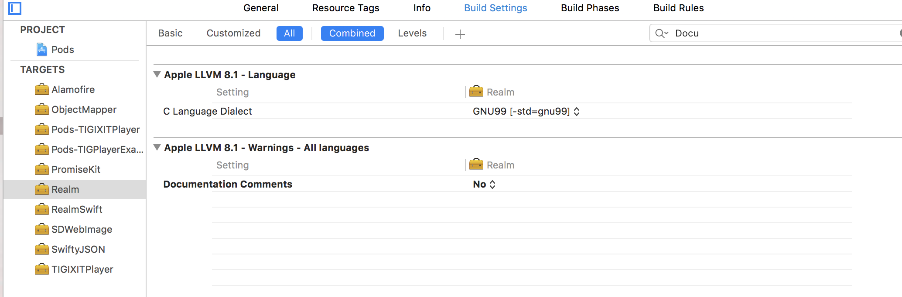

### TIG-Development-Frontend-iOS-TIGPlayer


~~~~
  use_frameworks!
  pod 'TIGPlayer', :git => 'git@github.com:iXIT-TIG/TIG-Development-Frontend-iOS-TIGPlayer.git', :branch => 'master'
~~~~

### プロジェクトにcocoapod経由でライブラリをインポートした後にビルドするための手順
1.`pod update`<br>
2.プロジェクトTIGIXITPlayerに切り替えてシュミレーターでビルド<br>
3.プロジェクトExportFrameworkでビルド<br>
4.実機端末で起動。<br>
<br>

内製ライブラリ内(TIGIXITPlayer)で外部ライブラリを使用可能にするためにシュミレータで一度起動して、<br>
データを取得した後にExportFrameworkを選択するとSDKとして吐き出される。<br>
*TIGIXITPlayer.Target内にExportFrameworkのScriptがある。*<br>

### 外部ライブラリを追加する際の注意点
1.TIGIXITPlayer.podspecに追加したライブラリを記述


http://qiita.com/hsylife/items/0d56ab0952ccc5f61d45

### Pod Realme警告レベル設定



### ライブラリ（SDK）のためのアクセスコントロールについて
TIGPlayerプロジェクトの機能は原則的に外部に公開いたしません。 <br>
そのため原則的に open、public クラスには @ACCESS_OPEN、@ACCESS_PUBLIC というメタデータを記述し、<br>
後述するスクリプトで intarnal と切り替え出来るようにします。<br>
##### ライブラリ用に internal に切り替え
```
cd TIGPlayer
python ./access_control.py --internal
```
##### 内製用に open、public に切り替え
```
cd TIGPlayer
python ./access_control.py --restore
```
